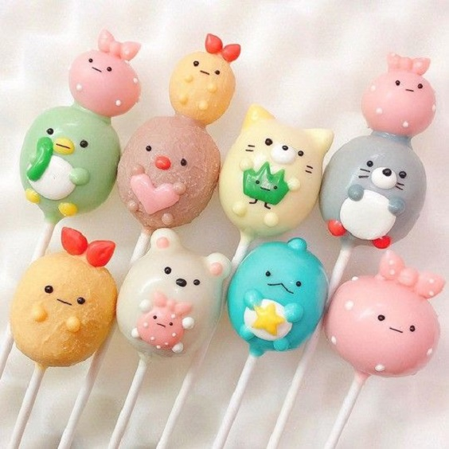
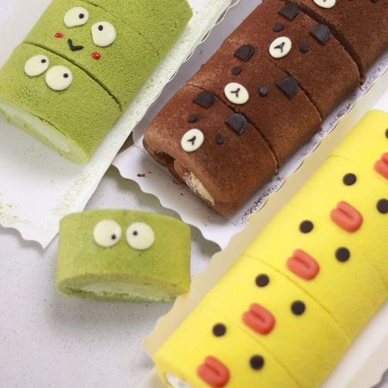
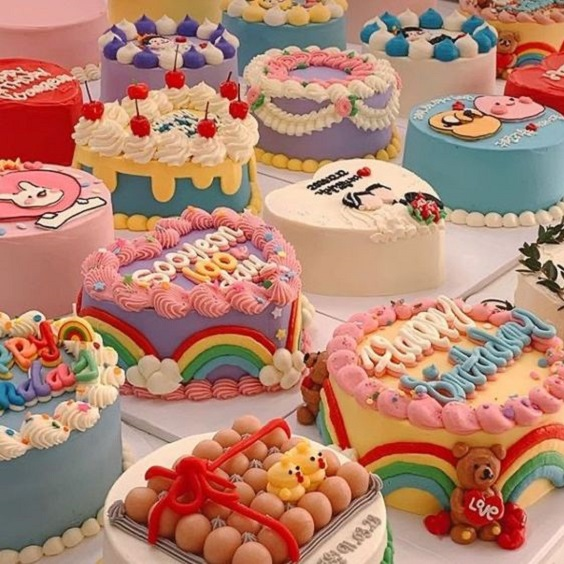
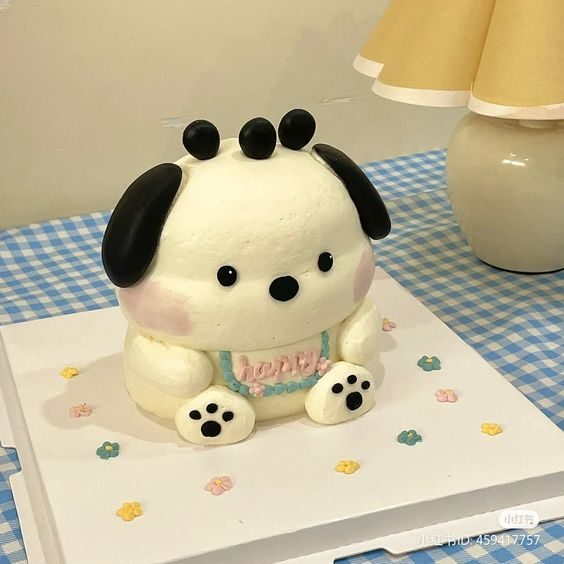
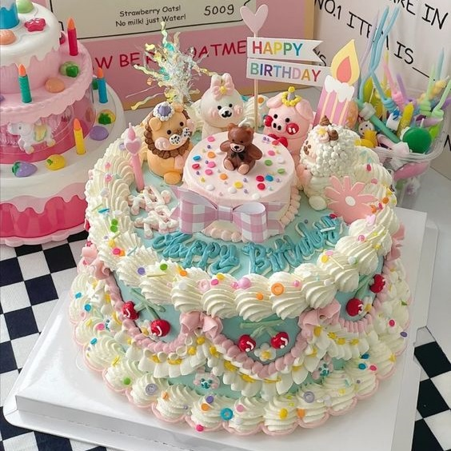
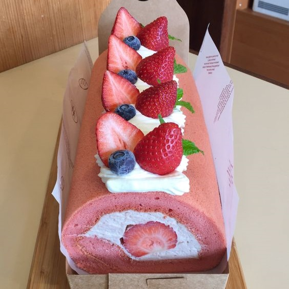
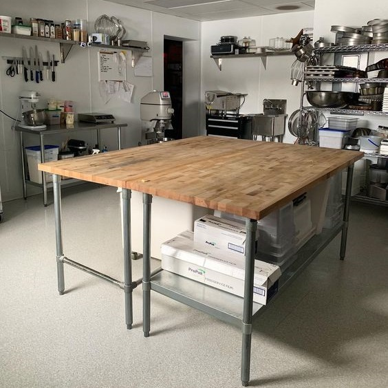
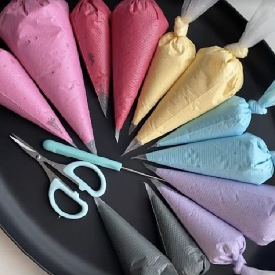
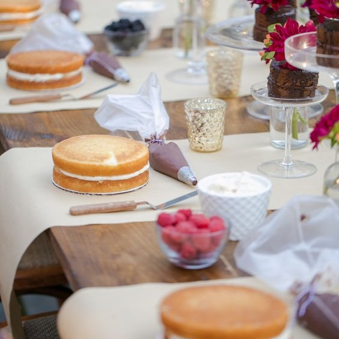

# capstone1

Capstone one is the product of three weeks of pluralsight prework and 1 week of Learn To Code Academy.

The basis of the capstone assignment is to created a website containing content, products, forms and a way to navigate from page to page. These are not the only requirments but let's not dive too deep into the details.

Cake Break is a bakery that provides goods and one service. There is not much to the history. Browse the menu items. Checkout the your options. Customize your choice with your favorite cake flavor and icing flavor. Vegan or gluten-free? or maybe a bit of both? Request special touches on your sweet treat. Spoil yourself of maybe that special someone.

Process: Using prior knowledge, the internet and problem solving skills. I was able to utalize my resource and make my own code. I have learn a multitude of different aspects of html, CSS and Bootstrap. I am continuing to learn.

Table of content:

1. index.html (Home Page)
   images:
   
   
   
   
   
   
   
   
2. story.html (Our Story)
   images:
   
   
   
3. checkout.html (Checkout and Shopping cart)
   images:
   
   
   
   
   
4. cakes.html (Cake products)
   images:
   
   
   
   
   
   
5. boxcakes.html (Different box cake products)
   images:
   
   
   
   
   
6. cupcakes.html (Cupcake product)
   images:
   
   
   
7. cakepops.html (Cake pop product)
   images:
   
   
   
8. cakerolls.html (Swiss roll cake products) images:
   
   
   
   
9. workshop.html (Build-a-Cake Workshop)
   images:
   
   
   
   
   
   
   
